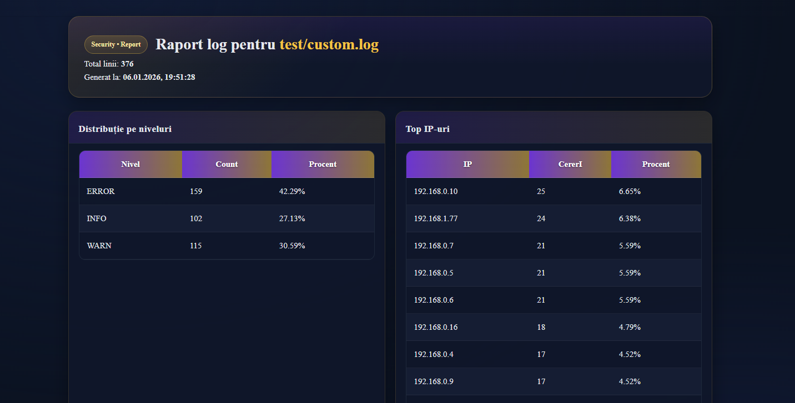
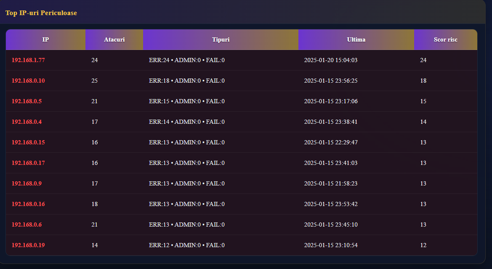
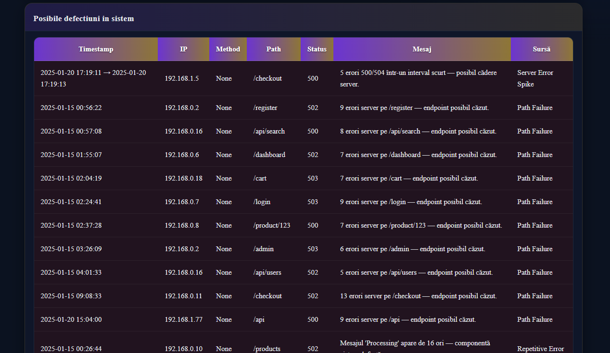
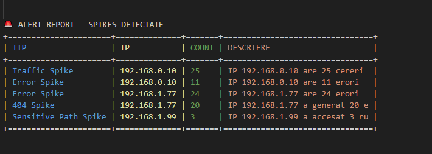
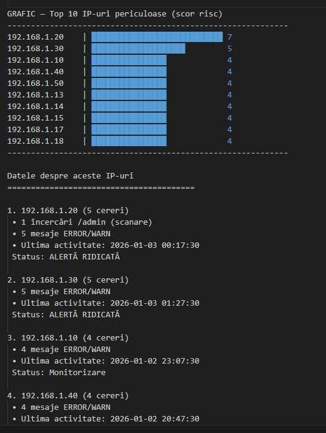

# Log Analyzer
## Autor
- Nume: Bota Maria Larisa
- Grupa: 1.2
- Email: maria-larisa.bota@student.upt.ro
- An academic: 2025–2026

##  Aplicație CLI în Python pentru analiza fișierelor de log (Apache, Nginx, Syslog, JSON, custom).
##  Permite filtrarea intrărilor, generarea de statistici, detectarea anomaliilor (spike-uri de erori, activitate suspectă, alerte de securitate) și exportul rezultatelor în raport HTML. Include și un mod de monitorizare live (dashboard) care citește doar liniile noi din log.

## 📌 Funcționalități

###  Analiză & filtrare
- Suport pentru fișiere de log: **Apache / Nginx / Syslog / JSON / Custom**
- Filtrare după text sau level: `--filter` (ex: `ERROR`, `TypeError`, `timeout`)
- Filtrare după dată: `--date` (format `YYYY-MM-DD`)

###  Statistici & topuri
- Statistici generale despre log: `--stats`
- Top 10 IP-uri (după apariții): `--top_ips`
- Top 10 IP-uri periculoase (în funcție de reguli/heuristici): `--dangerous`

###  Detectare anomalii & securitate
- Detectare spike-uri de erori într-o fereastră de timp: `--spikes`
- Detectare activitate suspectă: `--suspicious`
- Afișare alerte de securitate detectate: `--alert`

###  Dashboard live (monitorizare în timp real)
- Pornește dashboard live (citește doar liniile noi din log): `--watch`
- Setează intervalul de refresh (secunde): `--refresh` (default: `2`)

###  Raportare
- Generare raport HTML complet: `--report html`
- Setarea fișierului de output: `--output` (default: `raport_complet.html`)


### 🌐 Server web (vizualizare raport HTML)
Aceasta este funcționalitatea principală a aplicației, care generează un raport
HTML complet cu statistici, top IP-uri, anomalii și alerte de securitate.

- Pornește serverul web local: `--serve`
- Afișează link pentru raportul HTML în browser
- Necesită: `--report html`
-se opreste cu Crt-C
```bash
docker run --rm -p 8003:8000 -v "${PWD}:/app" -v "${PWD}:/out" log_analyzer \
python /app/main.py test/apache.log --report html --output /out/raport.html --serve
```
## Exemple de rulare 
```bash
python main.py test/apache.log --report html --output raport.html
python main.py test/nginx_access.log --spikes
python main.py test/apache.log --stats
python main.py test/custom.log --date 2025-01-15
python main.py test/nginx_error.log --top_ips --dangerous
python main.py test/nginx_error.log --filter ERROR
python main.py test/custom.log --alert
python main.py test/syslog.log --top_ips
python main.py test/json.log --suspicious

```

## Exemplu de RAPORT html 







##  Screenshots din terminal







## Fisierul output_comenzi.csv
Rezultatele comenzilor sunt salvate și în `output_comenzi.csv`.

## Structura proiectului
```bash
project/
├── main.py              # entry point CLI
├── conversion/          # parsare & normalizare loguri
│   ├── loader.py
│   └── detector.py
├── raport/              # generare raport HTML
│   └── creaza_raport.py
├── test/                # fișiere log de test
├── terminal_screen/     # screenshots din terminal
├── output_comenzi.csv   # rezultate comenzi
├── Dockerfile
├── requirements.txt
└── README.md
```


## Tehnologii folosite
  - Limbaj: Python 3.10+
   - Biblioteci:
        - re – parsarea liniilor de log folosind expresii regulate
        - datetime – procesarea și filtrarea datelor și orelor din loguri
        - os – lucrul cu fișiere și căi de sistem
        - time – controlul intervalului de refresh pentru monitorizarea live
        - collections.Counter – calcularea statisticilor și topurilor (IP-uri, erori)
        - webbrowser – deschiderea automată a raportului HTML în browser
        - html – escape pentru caractere speciale în raportul HTML
        - argparse – gestionarea argumentelor din linia de comandă (CLI)
        - sys – configurarea encoding-ului și output-ului în terminal
        - http.server – rularea unui server web local pentru raport
         - socketserver – gestionarea conexiunilor de rețea ale serverului web


## Instalare 
git clone https://github.com/larisamariabota/log-analyzer.git
cd log-analyzer
pip install -r requirements.txt

